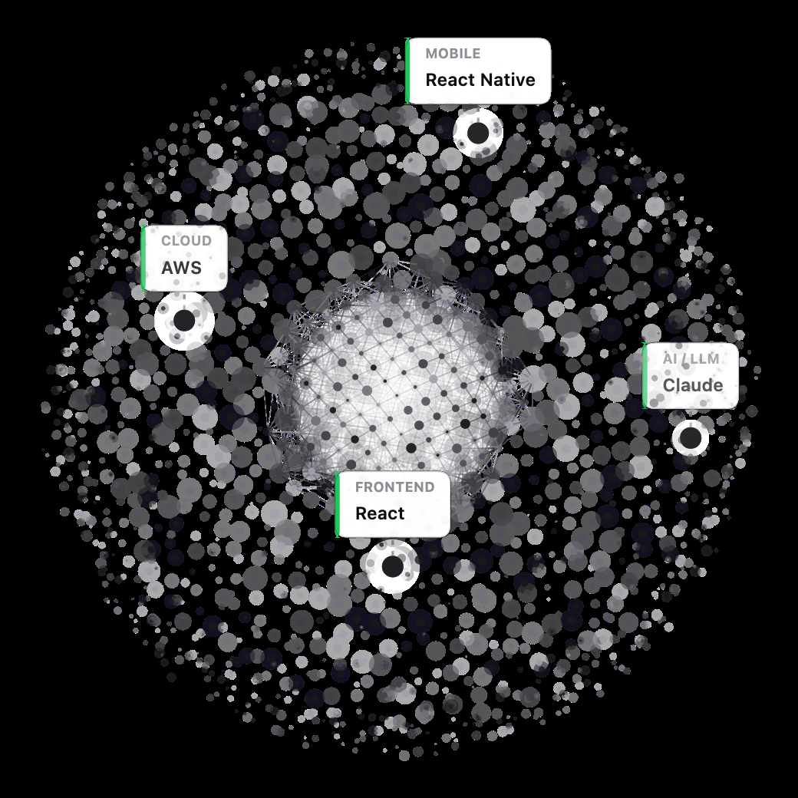
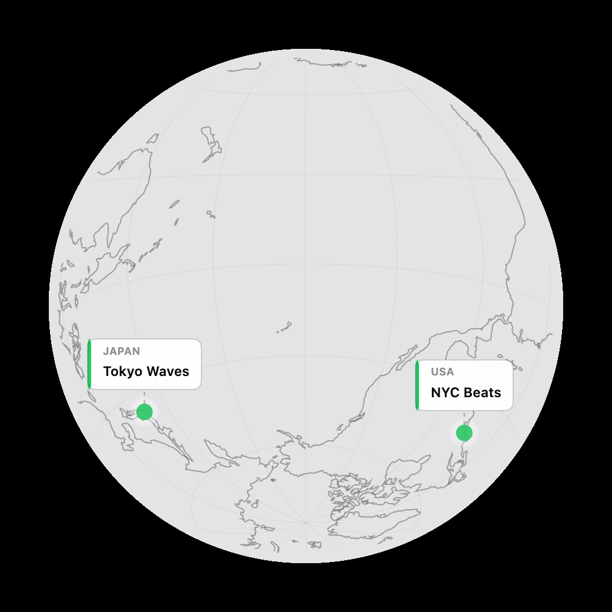

# OrbitOS

A rotating sphere of labeled points for React: render any set of skills,
links, projects, radio stations, offices, or facts as an animated, 3D-style
particle globe. Two modes: an abstract point-cloud **sphere**, or an actual
**world map** with continent outlines and points plotted by real lat/lng.
Pure HTML5 Canvas 2D, no Three.js/WebGL, no charting library.

| Sphere mode | Globe mode |
| --- | --- |
|  |  |

## See it in action

OrbitOS grew out of the sphere on my own portfolio site. A few places it (or
the code it was extracted from) shows up:

- [batsonlabs.com](https://batsonlabs.com/): the sphere mode, front and center on the homepage hero, showing my skills.
- [afritel.co.ke](https://afritel.co.ke/)
- [batsonlabs.com/blog/ai-radio](https://batsonlabs.com/blog/ai-radio): a blog post from the same site.

## Why

Most "3D sphere" components pull in a full WebGL stack for something that's
really just a rotating point cloud with a few floating labels. OrbitOS does
the projection math by hand on a plain `<canvas>`, small, dependency-free,
and easy to read if you want to tweak it.

## Install

This isn't published to npm yet: clone it and build locally, or copy
`src/OrbitGlobe.tsx` directly into your project.

```bash
git clone https://github.com/<you>/OrbitOS.git
cd OrbitOS
npm install
npm run build
```

Then link it into a project with `npm link`, or `npm install ../OrbitOS`.

## Usage

```tsx
import { OrbitGlobe } from "orbitos";

const points = [
  { label: "Frontend", name: "React", color: "#2563eb" },
  { label: "Backend", name: "Node.js", color: "#059669" },
  { label: "AI / LLM", name: "Claude", color: "#7c3aed" },
  { label: "Cloud", name: "AWS", color: "#d97706" },
];

export default function Example() {
  return (
    <div style={{ width: 480, height: 480 }}>
      <OrbitGlobe points={points} centerImage="/avatar.png" />
    </div>
  );
}
```

### World map mode

Switch `mode="globe"` and give points a real `location` instead of a `color`-only
callout, useful for radio stations, offices, or anywhere with a real address:

```tsx
const stations = [
  { label: "Kenya", name: "Nairobi FM", color: "#22c55e", location: { lat: -1.29, lng: 36.82 } },
  { label: "UK", name: "London Radio", color: "#22c55e", location: { lat: 51.51, lng: -0.13 } },
];

<OrbitGlobe points={stations} mode="globe" />;
```

`OrbitGlobe` must be rendered in a client component (it uses `"use client"`
internally, so this only matters if you're on Next.js App Router, no extra
setup needed).

## Props

| Prop              | Type                     | Default                  | Description                                                      |
| ------------------ | ------------------------ | ------------------------- | ------------------------------------------------------------------ |
| `points`           | `OrbitPoint[]`           | (required)                | The labeled callouts orbiting the sphere.                          |
| `mode`             | `"sphere" \| "globe"`    | `"sphere"`                 | Abstract particle sphere, or an actual world map with continents.  |
| `centerImage`      | `string`                 | `undefined`                | Image URL shown glowing at the center (e.g. an avatar/logo).       |
| `maxSize`          | `number`                 | `700`                      | Max pixel size; shrinks to fit its parent below this.              |
| `ambientDotCount`  | `number`                 | `1800`                     | Ambient background particle count (sphere mode only).             |
| `ambientColors`    | `string[]`               | grayscale set               | Palette for the ambient sphere dots (sphere mode only).            |
| `palette`          | `string[]`               | 9-color default             | Fallback dot/card color for points without an explicit `color`.    |
| `rotationSpeed`    | `number`                 | `0.00011`                   | Radians of rotation per millisecond.                                |
| `globeFillColor`   | `string`                 | `"#0a0a0f"`                 | Planet base fill color (globe mode only).                          |
| `globeLineColor`   | `string`                 | `"rgba(255,255,255,0.35)"`  | Continent outline / grid line color (globe mode only).             |
| `showGraticule`    | `boolean`                | `true`                       | Whether to draw a faint lat/lng grid (globe mode only).            |
| `className`        | `string`                 | `undefined`                  | Extra class on the wrapper element.                                  |
| `style`            | `CSSProperties`          | `undefined`                  | Extra inline styles on the wrapper element.                          |

### `OrbitPoint`

```ts
type OrbitPoint = {
  label: string;                                    // small eyebrow text
  name: string;                                      // main callout text
  color?: string;                                    // dot/accent color
  position?: { x: number; y: number; z: number };    // fixed spot on the unit sphere (sphere mode)
  location?: { lat: number; lng: number };           // real-world position (globe mode)
};
```

If neither `position` nor `location` is given, points are spread evenly
across the sphere using a golden-angle spiral so callouts don't cluster on
one side.

## How it works

**Sphere mode**: a few thousand tiny particles are distributed over a unit
sphere (golden-angle spiral) and projected to 2D each frame with hand-written
rotation/perspective math, no matrix library needed for a single-axis
auto-rotate.

**Globe mode**: continent outlines come from a simplified [Natural
Earth](https://www.naturalearthdata.com/) coastline dataset (public domain,
via `world-atlas`), embedded as plain lat/lng polylines and projected through
the same rotation math, no map library, no tiles, no network requests.

In both modes, your `points` become colored dots at fixed (or real-world)
positions on the sphere. When one rotates to the front, it fades in a
floating label card with simple rectangle-overlap collision detection so
cards never stack. Rendering pauses automatically via `IntersectionObserver`
when the globe scrolls out of view.

## License

MIT
